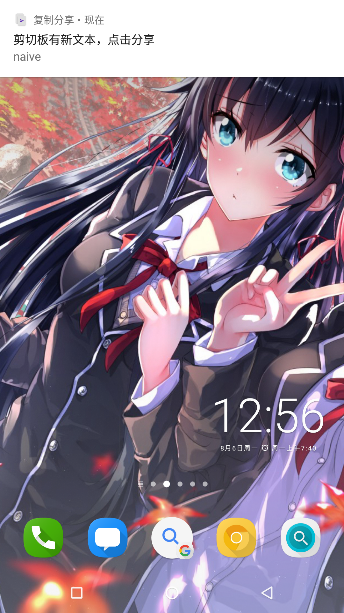
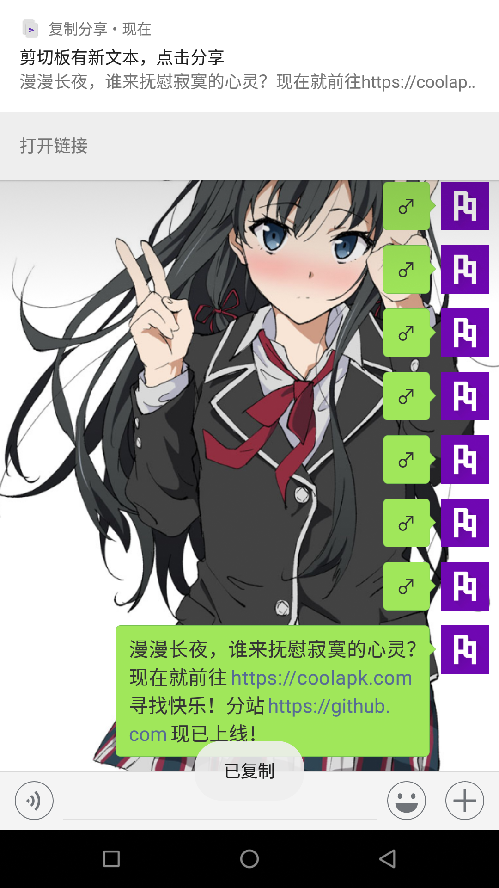

# Copy & Share

Copy and share clipboard content via system share UI.

## Features

* **Notify on copy.** Heads-up notification is shown when new text is copied or cut.

* **Pick links in text.** Open links contained in copied text on one tap. Link selection is supported when more than one links are found.

## Screenshots

